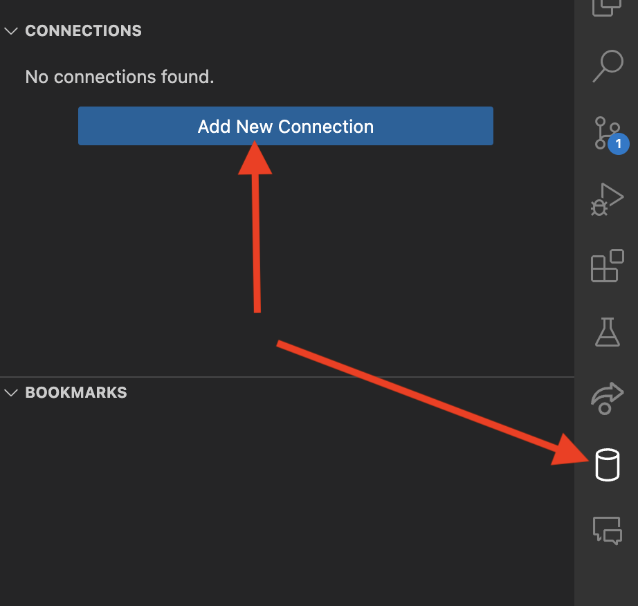
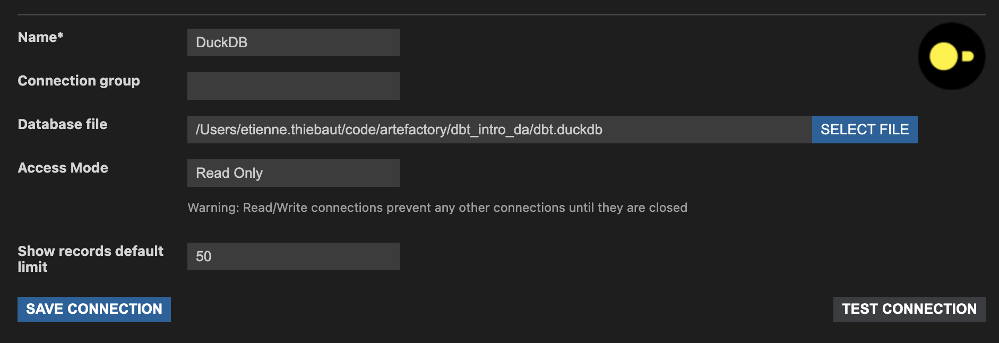
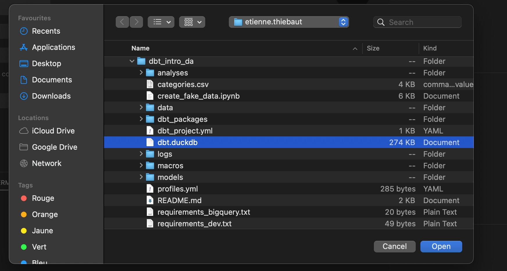
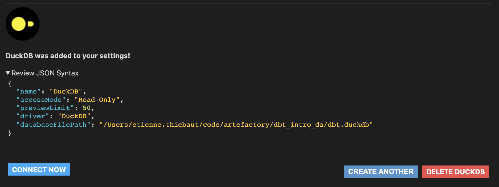
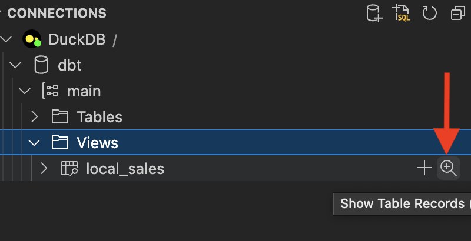
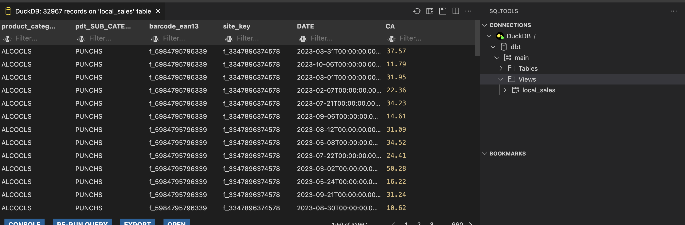
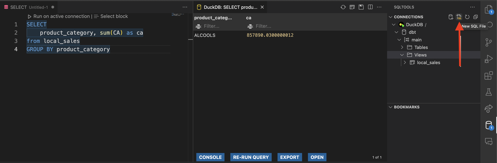

## SETUP:


### Requirements

- [Download and install Python](https://www.python.org/downloads/)
- [Download and install Git](https://git-scm.com/downloads)
- [Download and install Nodejs](https://nodejs.org/en/download)
- [Download and install VScode](https://code.visualstudio.com/download)
- For windows: [Download and install windows terminal](https://learn.microsoft.com/en-us/windows/terminal/install)

### Get the code and install python environment

- Open a terminal
- Clone the repository: `git clone https://github.com/artefactory/dbt_intro_da.git`
- Change directory in the repository folder: `cd dbt_intro_da`
- Setup a python environment: 
    - MacOs: `python3 -m venv .venv`
    - Windows: `python -m venv .venv`
- Activate python environment:
    - MacOs: `source .venv/bin/activate`
    - Windows:
      - `Set-ExecutionPolicy -ExecutionPolicy Unrestricted -Scope CurrentUser`
      - `. .\.env\Scripts\activate`
- Install python packages `pip install -r requirements.txt`

<details>
  <summary>Additionnal setup to work with bigquery (optionnal)</summary>

### Additionnal setup to work with bigquery (optionnal)

In order to work with bigquery you need to change the target in the profiles to the bigquery target.
You also need to update the dataset used in the profile by changing `name` to your name.

```
dbt_intro_da:
  target: dev_bigquery
  outputs:
    duckdb:
      path: dbt.duckdb
      type: duckdb
      threads: 4
    dev_bigquery:
      type: bigquery
      method: oauth
      project: formation-sql-316408
      dataset: dbt_intro_da_name
      location: EU
      threads: 4

```

- [Download and install Gcloud](https://cloud.google.com/sdk/docs/install)
- Connect to gcloud:
```
gcloud auth application-default login \
--scopes=https://www.googleapis.com/auth/bigquery,\
https://www.googleapis.com/auth/drive.readonly,\
https://www.googleapis.com/auth/iam.test

```

</details>


### DBT Setup and test

- `dbt debug` should now tell you everything is OK
- `dbt deps` to install dbt packages used in this project
- `dbt run`

The first `dbt run` should create a file named `dbt.duckdb`.
This file will contains all the tables views we are creating.

### Connection to the database with VScode:

To observe and monitor the new tables and views we are creating with dbt we can use VScode and some extensions to explore our database:
- Install the extension: https://marketplace.visualstudio.com/items?itemName=Evidence.sqltools-duckdb-driver
- During and after the installation the extension it will probably ask you to confirm the installation of some tools.
- Setup the connection with the duckdb database file:
    - In the sqltool extension menu click on add connection: 
        - 
    - Fill info in connection settings, you can keep the connection name to DuckDB or give it a more meaningfull name.
        - 
    - You should find a file named `dbt.duckdb` in the folder of `dbt_intro_da` if the command `dbt run` finished without errors.
        - 
    - Confirm the connection with `CONNECT NOW`
        - 
    - Browse the database, in `main/view` you should find `local_sales`. You can then click on the magnifier icon to show `local_sales` data
        - 
    - You should then see a VScode window with the following. From it you can explore, sort and filter data.
        - 
    - You can also run custom query to explore de data present in the database:
        - 


